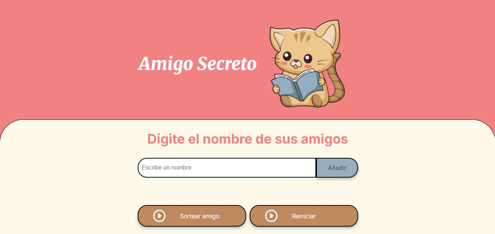

# 🎁 Challenge: Amigo Secreto

Este proyecto es una aplicación web sencilla que permite organizar un sorteo de **Amigo Secreto**.  
Los usuarios pueden agregar nombres a una lista y luego sortear aleatoriamente quién será el amigo secreto.

## 🚀 Características

- Agregar nombres de amigos a la lista.
- Validación para evitar nombres vacíos o repetidos.
- Visualización de la lista de amigos ingresados.
- Sorteo aleatorio del amigo secreto.
- Interfaz simple y amigable.

## 📂 Estructura del Proyecto
challenge-amigo-secreto/
├── index.html # Página principal  
├── style.css # Estilos de la aplicación  
├── app.js # Lógica en JavaScript  
├── assets/ # Imágenes utilizadas  
│ ├── amigo-secreto.png  
│ ├── gatito.webp  
│ └── play_circle_outline.png  
└── README.md # Documentación  

## 🖥️ Tecnologías Utilizadas

- **HTML5** → estructura de la página  
- **CSS3** → estilos y diseño responsivo  
- **JavaScript (ES6)** → lógica de la aplicación  

## 📸 Vista previa

## ▶️ Uso

1. Abre `index.html` en tu navegador.
2. Escribe el nombre de un amigo en el campo de texto.
3. Haz clic en **Agregar** para sumarlo a la lista.
4. Cuando tengas todos los nombres, haz clic en **Sortear Amigo Secreto**.
5. El programa seleccionará un amigo secreto al azar.

## 🌐 Deploy en Vercel

Puedes probar la aplicación en el siguiente enlace:  

👉 [Amigo Secreto en Vercel](https://challenge-amigo-secreto-theta-two.vercel.app/)

## 👩‍💻 Autor

Hecho por **Yadira Gamboa**
